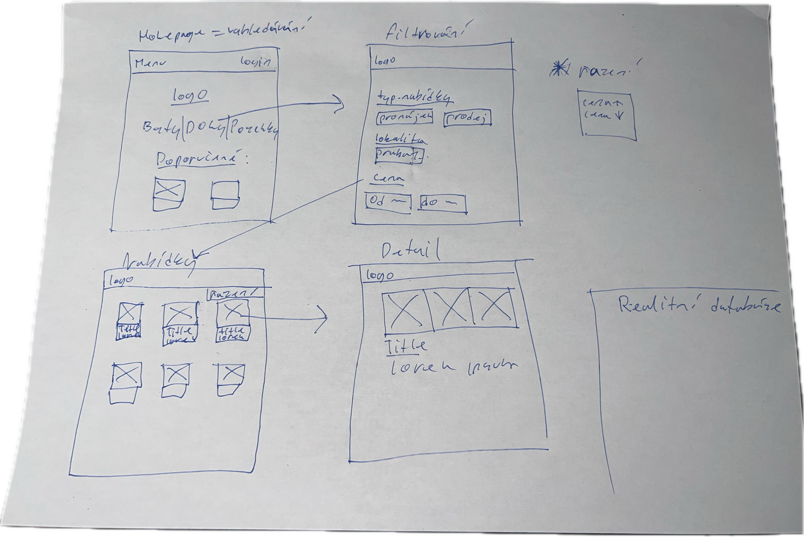
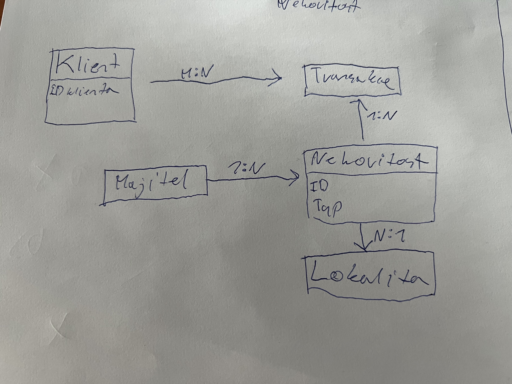

# Realitní databáze
autor: Matyáš Brtáň

## Odborný článek
Realitní databáze je webová aplikace dostupná na ---. Umožňuje spravovat a prohlížet nabídky nemovitostí k pronájmu či koupi.

Každá nemovitost v databázi má atributy: název, typ (dům, byt, pozemek), lokalita, cena, velikost pozemku, počet místností, popis a fotografie. Kromě toho obsahuje kontaktní informace na makléře. Každá nabídka patří k jedné lokalitě, která zahrnuje město, část města a stát.

Na hlavní stránce je seznam nabídek s možností filtrování (např. podle lokality, ceny, velikosti) a řazení (podle ceny či velikosti). Nabídky jsou prezentovány ve formě kartiček zobrazujících název, typ, lokalitu, cenu a hlavní fotografii. Kliknutím na kartičku se zobrazí detail nabídky se všemi atributy a galerií fotografií.

Detail lokality zobrazuje všechny nemovitosti v dané oblasti. Uživatelé mohou filtrovat a třídit nabídky přímo na této stránce.

Hlavní menu obsahuje odkazy na seznam nabídek a seznam lokalit. 

## Wireframes

## DB Schema

